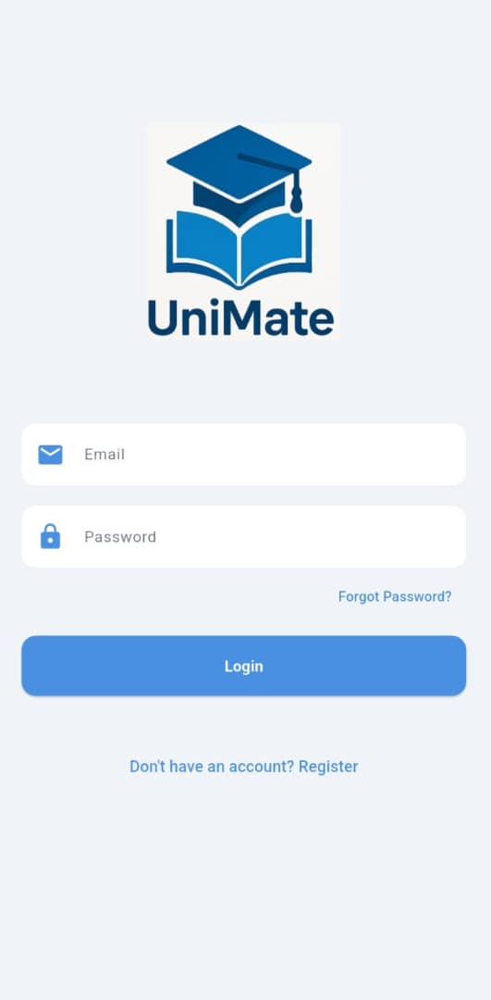
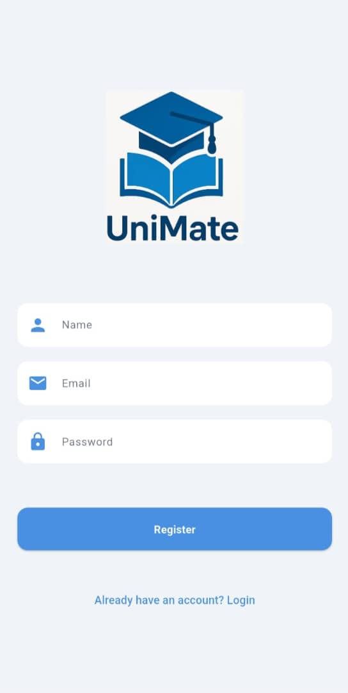
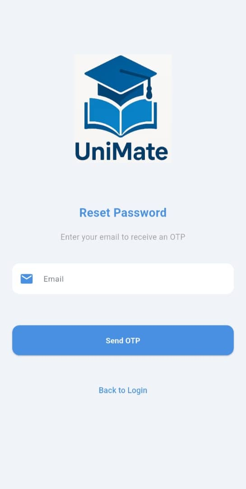
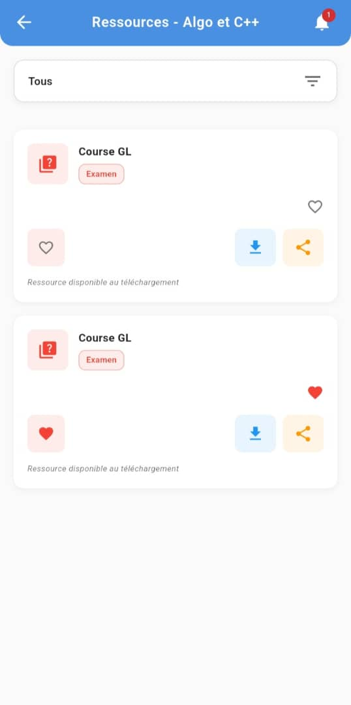
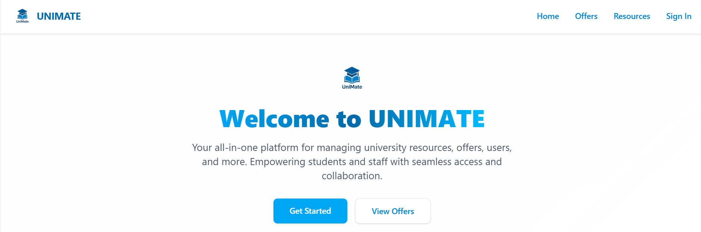
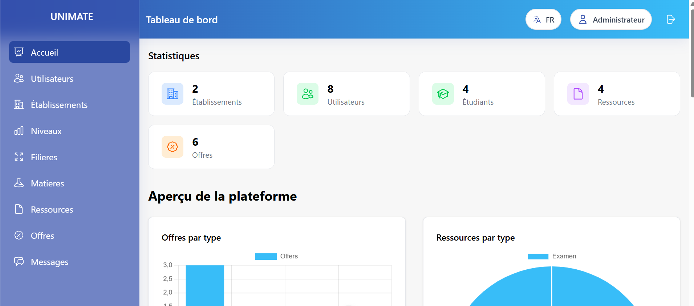

# 🎓 UniMate – University Mobile & Web Platform

**UniMate** is a hybrid application (**Web + Mobile**) designed to enhance the academic experience of higher education students in Mauritania. It centralizes university resources, facilitates student communication, provides training and internship opportunities, and offers a powerful dashboard for administrators.

---

## 🧭 Table of Contents

- [🎓 UniMate – University Mobile \& Web Platform](#-unimate--university-mobile--web-platform)
  - [🧭 Table of Contents](#-table-of-contents)
  - [🎯 Project Objectives](#-project-objectives)
  - [📱 Student Mobile App](#-student-mobile-app)
    - [✨ Key Features (Mobile)](#-key-features-mobile)
  - [🖥️ Web Admin Interface](#️-web-admin-interface)
    - [✨ Key Features (Web)](#-key-features-web)
  - [🔐 Security \& Authentication](#-security--authentication)
  - [📸 Screenshots](#-screenshots)
    - [📱 Mobile](#-mobile)
    - [🖥️ Web](#️-web)
  - [🛠️ Technologies Used](#️-technologies-used)
    - [📱 Mobile](#-mobile-1)
    - [🖥️ Web](#️-web-1)

---

## 🎯 Project Objectives

- 🎓 Facilitate access to academic resources (lectures, practicals, exams, etc.)
- 🤝 Provide a platform for student interaction and collaboration
- 💼 Offer internship, training, and certification opportunities
- 🗂️ Organize academic content (subjects, specialties, levels)
- 🧭 Assist new students with academic orientation and integration

---

## 📱 Student Mobile App

The mobile app is intended for students, providing them with easy access to essential tools for managing their academic journey.

### ✨ Key Features (Mobile)

- 📥 **Document Downloads**  
  - Access to PDF, DOCX, PPT files, etc.
- 🔍 **Smart Search**  
  - By subject, university, or document type
- 💬 **Discussion Forum**  
  - Ask questions, get answers, and start academic discussions
- 🏷️ **Dedicated Student Groups**  
  - Organized by field of study, level, and university
- 🧑‍🎓 **Internship & Training Opportunities**  
  - Local offers, certifications, CV and cover letter coaching
- 📚 **Personal Learning Space**  
  - Download history, bookmarks, frequently accessed resources
- 🔐 **Secure Login**  
  - JWT-based authentication and password recovery

---

## 🖥️ Web Admin Interface

The web interface is designed for administrators to efficiently manage the platform’s content and users.

### ✨ Key Features (Web)

- 📊 **Interactive Dashboard**
  - Statistics per institution: students, resources, downloads
  - Charts: by resource type, offer type, downloads per institution
- 👥 **User Management**
  - Students, moderators, and administrators
- 🏫 **Institution Management**
  - Add, edit, or delete institutions
- 🧪 **Academic Structure Management**
  - Specialties, academic levels, and subjects
- 📂 **Academic Resources**
  - Upload, categorize, and filter documents
- 📢 **Opportunity Management**
  - Post internships, training programs, and certifications
- 📬 **Messaging System**
  - Receive and respond to student messages via admin panel

---

## 🔐 Security & Authentication

- 🔑 Secure login using JWT authentication
- 🧾 Password recovery system for forgotten credentials
- 🛡️ Role-based access control: Student / Admin
- 🧼 Strict form validation and data verification

---

## 📸 Screenshots

### 📱 Mobile

- 🔐 Authentication  
    
    
  

- 📚 Resource Access  
  

### 🖥️ Web

- 🏠 Landing Page  
    
  

- 📊 Admin Dashboard  
  

---

## 🛠️ Technologies Used

### 📱 Mobile

- **Framework**: Flutter  
- **State Management**: BLoC / Provider  
- **API**: Secure REST API

### 🖥️ Web

- **Frontend**: Nuxt.js / Vue.js  
- **Backend**: Django REST Framework  
- **Database**: MySQL  
- **Security**: JWT Authentication

---